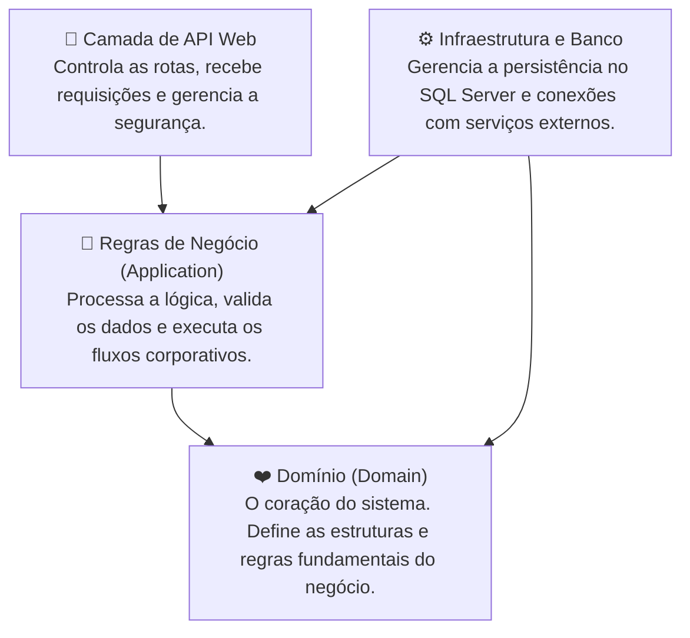

# 🏥 Clínica Mais Saúde — Sistema de Gestão Inteligente

<br>


O **Clínica Mais Saúde** é uma solução corporativa de gestão clínica inteligente projetada para otimizar a rotina operacional de consultórios, clínicas e hospitais. Focado em alta usabilidade e eficiência, o sistema centraliza todas as etapas do ciclo de atendimento — da triagem inteligente do paciente até a geração de relatórios de desempenho —, resolvendo problemas históricos da gestão de saúde, como salas de espera lotadas, desorganização de agendas e ausência médico.

---

## 🌟 Funcionalidades e Recursos do Sistema

### 🧠 Triagem Clínica Inteligente com Inteligência Artificial
Permite que o paciente descreva livremente seus sintomas durante a marcação da consulta. A IA integrada processa a descrição textual e recomenda automaticamente a especialidade médica mais indicada para o caso.

Para garantir a estabilidade do sistema, o módulo conta com filtros avançados contra abusos: mensagens fora do contexto de saúde ou tentativas de burlar as regras de segurança disparam bloqueio automático da conta e cancelamento dos agendamentos vinculados, notificando imediatamente a administração. Um limite diário de uso por usuário garante o controle dos recursos computacionais.

---

### 📊 Previsão Analítica de Faltas (em %)
Estima automaticamente a chance de um paciente não comparecer a uma consulta agendada. O motor do sistema cruza o histórico comportamental do paciente — faltas anteriores, remarcações recorrentes, cancelamentos em cima da hora e necessidades especiais registradas — com sua taxa de assiduidade.

A consulta é classificada em três categorias visuais de risco: **Baixo, Médio ou Alto**, capacitando a recepção a realizar confirmações ativas com antecedência nos agendamentos de maior risco.

---

### 📅 Distribuição Dinâmica e Regras de Agendamento
- **Balanceamento de Carga:** Novas consultas são direcionadas automaticamente ao profissional habilitado com menor quantidade de agendamentos no dia. Em caso de empate na quantidade de agendamentos do dia, será utilizada a quantidade total de agendamentos ativos como critério de desempate.
- **Slot de Atendimento:** Cada tipo de consulta possui duração padronizada (Triagem, Vacina, Exame, Consulta Médica, Retorno).
- **Retornos Vinculados:** Agendamentos de retorno direcionam o paciente obrigatoriamente ao mesmo médico do atendimento inicial.
- **Divisão de Competências:** Separação clara entre procedimentos de enfermagem e consultas médicas.

---

### 📊 Dashboard e Relatórios de Desempenho Administrativo
Visão em tempo real sobre a saúde operacional da clínica: volume de atendimentos, distribuição por especialidade, taxa de ausência e métricas de risco. Exportação de relatórios detalhados em **Excel** e **PDF** para fins de auditoria e planejamento.

---

### 🔔 Central de Notificações e Acompanhamento de Exames
Rastreia consultas que necessitam de emissão ou avaliação de exames clínicos. Gera alertas automáticos ao paciente quando o resultado estiver disponível, direcionando-o diretamente para o registro em destaque no histórico.

---

### 🔒 Segurança de Acesso Baseada em Perfis (RBAC)
Cada usuário possui uma experiência personalizada conforme seu papel (Administrador, Médico, Enfermeira ou Paciente). O sistema protege contas com limite de tentativas de login, bloqueio temporário por força bruta, sessões JWT com expiração controlada e renovação dinâmica via refresh token.

---

### 📋 Trilha de Auditoria Permanente
Todas as interações com agendamentos — criação, alteração de status, remarcações e cancelamentos — são registradas permanentemente com data, horário exato e identificação do operador responsável.

---

### 👤 Perfil do Usuário
Pacientes e profissionais podem visualizar e atualizar seus dados cadastrais, foto de perfil e, para médicos, suas especialidades médicas cadastradas.

---

## 🏗️ Arquitetura do Sistema

O back-end adota **Clean Architecture**, dividindo o código em camadas bem definidas:



---

## 🛠️ Tecnologias Utilizadas

| Camada | Tecnologia |
|---|---|
| Back-end | C# / .NET 10, Clean Architecture, Entity Framework Core, FluentValidation |
| Front-end | React 19, TypeScript, Vite, TailwindCSS v3 |
| Banco de Dados | SQL Server, EF Core Migrations |
| Inteligência Artificial | Google Gemini 2.5 Flash |
| Autenticação | JWT com Refresh Token, BCrypt |
| Exportação | QuestPDF (PDF), ClosedXML (Excel) |

---

## 🧪 Suíte de Homologação (E2E)
O projeto conta com um script que executa **25 validações automáticas de ponta a ponta** — fluxos normais e tentativas de uso incorreto — contra o servidor em menos de 3 segundos, exibindo um relatório interativo no terminal.

```bash
homologar.bat
```

---

## 👤 Autor

| Nome |
|---|
| Daniel Vinicius Carvalho dos Santos

---

## 📄 Licença

Copyright © 2026 Daniel Vinicius Carvalho dos Santos e colaboradores. Todos os direitos reservados.

Este software e seu código-fonte são propriedade exclusiva dos autores. É proibida a reprodução, distribuição, modificação ou uso comercial, total ou parcial, sem autorização expressa por escrito dos autores.
