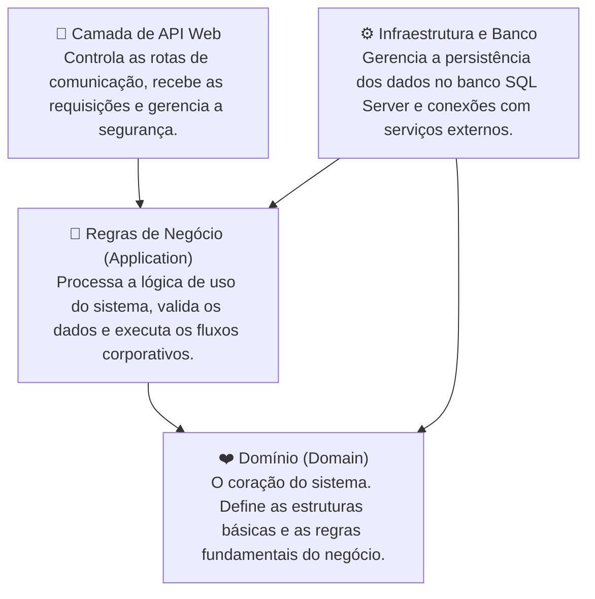

# 🏥 Clínica Mais Saúde — Sistema de Gestão Inteligente

<br>


O **Clínica Mais Saúde** é uma solução corporativa de gestão clínica inteligente projetada para otimizar a rotina operacional de consultórios, clínicas e hospitais. Focado em alta usabilidade e eficiência, o sistema centraliza todas as etapas do ciclo de atendimento — da triagem inteligente do paciente até a geração de relatórios de desempenho —, resolvendo problemas históricos da gestão de saúde, como as salas de espera lotadas, a desorganização de agendas e o absenteísmo médico.

---

## 🌟 Funcionalidades e Recursos do Sistema

O sistema é dividido em módulos inteligentes que integram tecnologia de ponta com regras de negócio sólidas para melhorar o dia a dia de pacientes, equipes de enfermagem, médicos e administradores.

### 🧠 Triagem Clínica Inteligente com Inteligência Artificial
Permite que o paciente descreva livremente seus sintomas físicos durante a marcação da consulta. A Inteligência Artificial integrada processa a descrição textual e recomenda automaticamente a especialidade médica mais indicada para o caso. 

Para garantir a estabilidade do sistema, o módulo conta com filtros avançados contra abusos: mensagens fora do contexto de saúde, termos inadequados ou tentativas de burlar as regras de segurança disparam um bloqueio automático da conta e cancelam agendamentos vinculados, notificando imediatamente a administração. O limite diário de uso por usuário garante o uso controlado dos recursos computacionais.

### 📊 Previsão Analítica de Faltas (Combate ao Absenteísmo)
Estima de forma automática a chance de um paciente não comparecer a uma consulta agendada. O motor do sistema cruza o histórico comportamental do paciente (quantidade de faltas anteriores, remarcações recorrentes, cancelamentos em cima da hora, consultas marcadas com muita antecedência e necessidades especiais registradas) com sua taxa de assiduidade. 

A consulta é então classificada em três categorias visuais de risco: **Baixo, Médio ou Alto**. Esta funcionalidade capacita a recepção a realizar confirmações ativas com antecedência nos agendamentos de maior risco, otimizando a ocupação da agenda médica e reduzindo perdas financeiras.

### 📅 Distribuição Dinâmica e Regras de Agendamento
O sistema gerencia de forma inteligente a alocação de profissionais de saúde para evitar sobrecargas e conflitos de horários:
* **Balanceamento de Carga:** As novas consultas são direcionadas automaticamente ao profissional de saúde habilitado que tiver a menor quantidade de agendamentos no dia.
* **Slot de Atendimento:** Cada consulta tem uma duração padronizada conforme a categoria selecionada (como Triagem, Vacina, Exame ou Consulta Médica).
* **Retornos Vinculados:** Em agendamentos de retorno, o sistema direciona o paciente de forma obrigatória ao mesmo médico que realizou o atendimento inicial, garantindo a continuidade do tratamento.
* **Divisão de Competências:** Há uma separação clara de responsabilidades, garantindo que procedimentos de enfermagem (como triagens e vacinas) e consultas médicas sejam executados apenas pelos respectivos profissionais.

### 📊 Dashboard e Relatórios de Desempenho Administrativo
Oferece aos administradores da clínica uma visão clara e em tempo real sobre a saúde financeira e operacional do negócio. O dashboard apresenta indicadores cruciais como o volume geral de atendimentos, a distribuição de consultas por especialidade e a taxa geral de absenteísmo da clínica. O gestor pode gerar e exportar relatórios detalhados nos formatos Excel e PDF com alta performance para fins de auditoria e planejamento.

### 🔔 Central de Notificações e Acompanhamento de Exames
Rastreia as consultas que necessitam de emissão ou avaliação de exames clínicos. O sistema gera alertas automáticos para avisar o paciente quando o resultado de seu exame estiver disponível no portal. Ao clicar no alerta, o paciente é direcionado de forma inteligente para seu histórico de consultas, com filtros limpos e o exame em questão destacado visualmente na tela para agilizar a visualização.

### 🔒 Segurança de Acesso Baseada em Perfis (RBAC)
Cada usuário possui uma experiência de navegação personalizada de acordo com seu papel na clínica (Administrador, Médico, Enfermeiro ou Paciente). Os dados cadastrais críticos e senhas são criptografados com padrões seguros. O sistema protege as contas limitando tentativas de login consecutivas (bloqueando a conta por 15 minutos em caso de suspeita de força bruta) e utiliza sessões protegidas com expiração controlada e renovação dinâmica.

### 📋 Trilha de Auditoria Permanente
Todas as interações cruciais com agendamentos — incluindo criação, alteração de status (de agendado para em atendimento ou finalizado), remarcações e cancelamentos — são registradas permanentemente no banco de dados. Cada entrada na trilha de auditoria armazena a data, o horário exato e a identificação do operador responsável pela modificação, garantindo total transparência e conformidade regulatória.

### 👤 Perfil do Usuário e Prontuário Simplificado
Permite que pacientes e profissionais de saúde visualizem seus dados cadastrais essenciais. Para garantir a segurança dos registros, alterações de dados críticos são efetuadas mediante validação. Os usuários podem carregar e atualizar uma foto de perfil, que é armazenada de forma otimizada no sistema.

---

## 🏗️ Arquitetura do Sistema

Para garantir facilidade de manutenção e alta escalabilidade, o backend adota os conceitos de **Clean Architecture (Arquitetura Limpa)**, dividindo o código em camadas bem definidas:



---

## 🛠️ Tecnologias Utilizadas

* **Backend:** C# / .NET 10 rodando de forma assíncrona, utilizando Entity Framework Core para persistência no banco SQL Server.
* **Frontend:** SPA moderna em React 19 + TypeScript, com carregamento rápido e design responsivo baseado em interfaces limpas e transições suaves.
* **Inteligência Computacional:** Integração com a API do Google Gemini para processamento de linguagem natural.

---

## 🚀 Como Executar o Projeto Localmente

### 1. Inicializando o Backend
1. Navegue até a pasta do backend:
   ```bash
   cd ClinicaMaisSaude.API
   ```
2. Aplique as atualizações e prepare o banco de dados:
   ```bash
   dotnet ef database update
   ```
3. Execute o servidor:
   ```bash
   dotnet run
   ```
   *O backend rodará na porta `http://localhost:5045`.*

### 2. Inicializando o Frontend
1. Navegue até a pasta do frontend:
   ```bash
   cd clinica-frontend
   ```
2. Instale os pacotes necessários e inicie o servidor local:
   ```bash
   npm install
   npm run dev
   ```
   *O frontend rodará no endereço `http://localhost:5173`.*

---

## 🧪 Suíte de Homologação de Funcionalidades (E2E)
O projeto conta com um script de teste dinâmico que executa **25 validações automáticas de ponta a ponta** (tanto fluxos normais quanto tentativas de uso incorreto) contra o servidor em menos de 3 segundos, exibindo um relatório interativo no terminal.

Para rodar a homologação:
1. Certifique-se de que a API do backend está em execução.
2. Na pasta raiz do projeto, execute o script:
   ```bash
   homologar.bat
   ```
