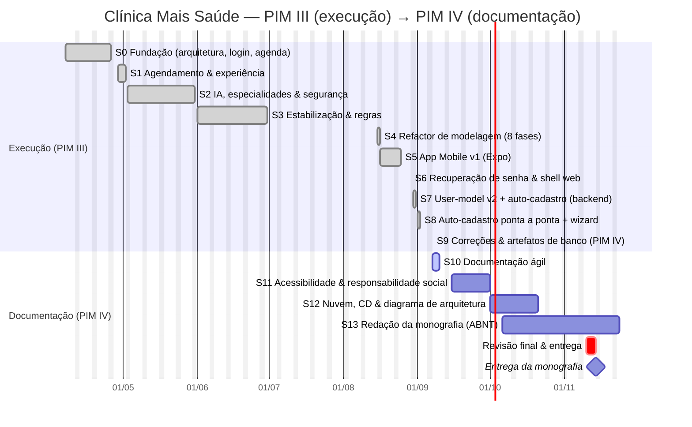

# Cronograma — Clínica Mais Saúde

Linha do tempo do desenvolvimento (derivada do histórico de commits) e o planejamento até a entrega da
**monografia do PIM IV em 14/11/2026**. Datas de desenvolvimento são reais; as da frente de documentação
são estimativas.

## Diagrama de Gantt

## Marcos (milestones)

| Data | Marco |
|------|-------|
| 08/04/2026 | 1ª migration EF Core; fundação da Clean Architecture |
| 26/04/2026 | Login, cadastro e agendamento base (web) |
| mai/2026 | Triagem por IA + especialidades + recuperação de senha (v1) |
| 16/08/2026 | Refactor de modelagem consolidado (`InitialCreate` + 8 fases) |
| 25/08/2026 | App Mobile v1 funcionalmente completo |
| 29/08/2026 | Recuperação de senha self-service (API+web+mobile) |
| 31/08/2026 | Auto-cadastro moderado no backend + editor da DS |
| 02/09/2026 | Auto-cadastro ponta a ponta com wizard e verificação de e-mail |
| 07/09/2026 | Correções mobile · 30 perguntas da DS · **artefatos de banco (PIM IV)** |
| **14/11/2026** | **Entrega da monografia do PIM IV** (ABNT) |

## Frente restante até a entrega

1. **Documentação ágil** (este pacote) — Product/Sprint Backlog, Kanban, Cronograma. *(em andamento)*
2. **Acessibilidade** — auditoria web + mobile; seção de responsabilidade social/inclusão.
3. **Nuvem & CD** — publicar em um provedor, pipeline de deploy, diagrama de arquitetura.
4. **Monografia ABNT** — capa, resumo/abstract, sumário, introdução, desenvolvimento (20–30 pág.),
   conclusão e referências, integrando os artefatos de web, mobile, banco e DevOps já produzidos.

> **Observação de método:** o projeto usou fluxo incremental contínuo (estilo Kanban) em vez de sprints de
> duração fixa. O agrupamento em "S0…S13" é uma leitura *a posteriori* para fins de documentação e não
> reflete cerimônias formais de Scrum.
