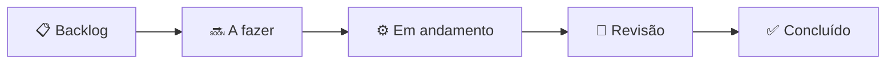

# Quadro Kanban — Clínica Mais Saúde

Retrato do fluxo de trabalho (atualizado em **07/09/2026**). O quadro reflete a situação das histórias do
[Product Backlog](PRODUCT_BACKLOG.md). Política de **WIP** (trabalho em progresso): no máximo **1–2 itens**
em *Em andamento* — o projeto é conduzido por uma equipe enxuta, priorizando fluxo contínuo.

## Fluxo

## Quadro (snapshot)

| 📋 Backlog | 🔜 A fazer | ⚙️ Em andamento | ✅ Concluído (recentes) |
|-----------|-----------|-----------------|--------------------------|
| E5-03 Push nativo FCM | E8-06 Auditoria de acessibilidade (web+mobile) | **Documentação ágil (PIM IV)** *(este pacote)* | E4-09 Auto-cadastro mobile em wizard |
| E8-05 Deploy em nuvem + CD | Seção de responsabilidade social/inclusão | | E4-02 30 perguntas oficiais da DS |
| E7-04 Painel de indicadores | Diagrama de arquitetura em nuvem | | E4-08 "Colar várias perguntas" no editor |
| 2º fator no 1º acesso | Monografia ABNT — seções escritas | | Artefatos de banco (MER/DDL/procedures) |
| Multi-tenant (unidades) | | | E4-03 Verificação de e-mail por código |
| Planos de saúde na home *(descartado por ora)* | | | E1-03 Recuperação de senha self-service |

## Regras de política (Definition of Done)

Um item só entra em **✅ Concluído** quando:
1. Código compila (build .NET 0 erros / `tsc` limpo) e passa nos **testes automatizados**.
2. A **CI** (GitHub Actions) está verde.
3. Mudança de schema tem **migration** aplicada e, quando aplicável, artefato de banco atualizado.
4. Alterações de fluxo foram **validadas** (homologação E2E, *smoke test* ou verificação no device).
5. Commit(s) na branch `teste` com mensagem descritiva.

## Métricas de fluxo (visão geral)

- **222 commits** entre 07/04 e 07/09/2026 · picos de entrega em maio (features) e agosto (refactor + mobile).
- **~107 testes** automatizados no backend + `tsc` (web/mobile) na CI.
- Cadência: entregas incrementais frequentes; sem *sprints* de duração fixa (fluxo Kanban orientado a tema).
