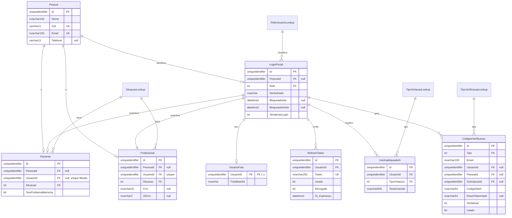
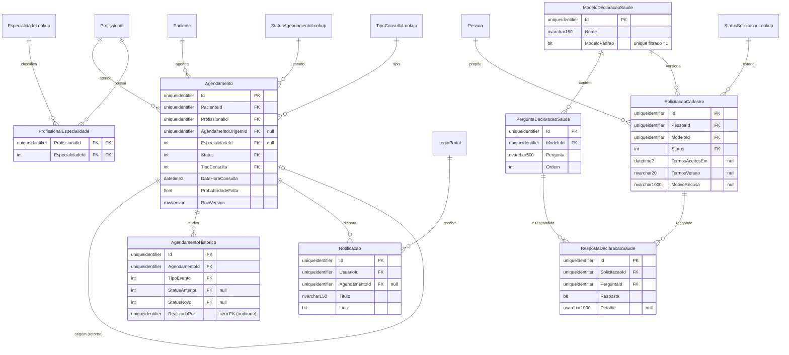

# Modelo de Dados — Clínica Mais Saúde

Artefato de Banco de Dados do PIM IV (rubrica 07). Descreve o **MER** (Modelo Entidade-Relacionamento),
o modelo lógico/físico e o dicionário de dados do sistema Clínica Mais Saúde.

- **SGBD:** Microsoft SQL Server (produção) / SQL Server LocalDB (desenvolvimento).
- **Origem do schema:** EF Core 10 *Code-First* — 22 *migrations* (`InitialCreate` → `Fase21`). O DDL
  equivalente está em [`01_schema.sql`](01_schema.sql); procedures e triggers em [`02_procedures_triggers.sql`](02_procedures_triggers.sql).
- **Total:** 26 tabelas — **16 de entidade** + **10 de referência (*lookup*)**.

> Este documento é gerado a partir do modelo vigente (`ClinicaDbContextModelSnapshot`) e mantido em sincronia
> com o código. Ao alterar o schema, regenere o DDL com
> `dotnet ef migrations script --idempotent` e revise as seções abaixo.

---

## 1. Convenções de modelagem

| Convenção | Descrição |
|-----------|-----------|
| **Chaves primárias** | `Guid` (`uniqueidentifier`) nas entidades de negócio, geradas como *sequential GUID* na aplicação (reduz fragmentação de índice). Os *lookups* usam `int` com valor fixo (sem *identity*), casando com o valor do `enum`. |
| **Auditoria** | Toda tabela mutável tem `Dt_Criado` (criação) e `ult_Atualizacao` (*updated-at*, carimbado automaticamente no `SaveChangesAsync`). Tabelas *append-only* (`AgendamentoHistoricos`, `UsoInadequadoIA`) e *lookups* não têm `ult_Atualizacao`. |
| **Tabelas de referência** | Cada `enum` do domínio vira uma tabela `*Lookup` (`Id`, `Nome`, `Dt_Criado`) semeada via `HasData`. As colunas de estado são `int` com FK para o respectivo *lookup*. |
| **Integridade referencial** | FKs com `ON DELETE NO ACTION` (`Restrict`) por padrão — evita exclusão em cascata acidental de dados clínicos. Exceções em `Cascade`/`SetNull` estão marcadas no dicionário (§4). |
| **Nomenclatura** | Tabelas no plural (`Pacientes`, `Agendamentos`); a tabela de credenciais é `LoginPortal` (entidade `Usuario`). Colunas de data seguem `Dt_Criado`/`Dt_Expiracao`. |
| **Índices únicos filtrados** | Usados para regras de unicidade parcial: um único modelo de DS vigente (`ModeloPadrao = 1`) e vínculo 1:1 opcional `Paciente.UsuarioId` (`IS NOT NULL`). |

---

## 2. Diagrama Entidade-Relacionamento (MER)

### 2.1 Núcleo — Identidade, Acesso e Segurança

### 2.2 Agendamento, Notificações e Auto-cadastro (Declaração de Saúde)

---

## 3. Tabelas de referência (*lookup*)

Semeadas por `HasData`; o `Id` **coincide com o valor do `enum`** para preservar dados já gravados.

| Tabela | Valores (`Id` = `Nome`) |
|--------|--------------------------|
| `RoleUsuarioLookup` | 1 Paciente · 2 Admin · 3 Medico · 4 Enfermeira |
| `SituacaoLookup` | 1 Ativo · 2 Inativo · 3 Excluido · 4 Banido · 5 EmAnalise |
| `StatusAgendamentoLookup` | 0 Agendado · 1 EmAtendimento · 2 AguardandoRetorno · 3 RetornoAgendado · 4 Finalizado · 5 Faltou · 6 Cancelado |
| `StatusSolicitacaoLookup` | 1 EmAnalise · 2 Aprovada · 3 Recusada |
| `TipoConsultaLookup` | 0 Triagem · 1 Exame · 2 Vacina · 3 ConsultaMedica · 4 Retorno |
| `TipoEventoHistoricoLookup` | 1 Criacao · 2 MudancaStatus · 3 Remarcacao · 4 Cancelamento |
| `TipoProfissionalLookup` | 0 Enfermeira · 1 Medico |
| `TipoVerificacaoLookup` | 1 RecuperacaoSenha · 2 PrimeiroAcesso · 3 VerificacaoEmail |
| `TipoViolacaoLookup` | 1 Injecao · 2 UsoIndevido |
| `EspecialidadeLookup` | 0..17 (ClinicaGeral, MedicinaDeFamilia, Pediatria, … MedicinaEsportiva) |

---

## 4. Dicionário de dados (tabelas de entidade)

Colunas comuns omitidas por brevidade quando repetitivas: `Dt_Criado` (`datetime2`, criação) existe em todas;
`ult_Atualizacao` (`datetime2`, *null*) existe nas tabelas mutáveis. **PK** = chave primária, **FK** = chave
estrangeira, **UK** = única.

### `Pessoa` — identidade única da pessoa física
| Coluna | Tipo | Restrições |
|--------|------|-----------|
| `Id` | uniqueidentifier | PK |
| `Nome` | nvarchar(100) | NOT NULL |
| `Cpf` | varchar(11) | NOT NULL, **UK** |
| `Email` | nvarchar(150) | NOT NULL, **UK** |
| `Telefone` | varchar(11) | NULL |

### `LoginPortal` — credencial de acesso (entidade `Usuario`)
| Coluna | Tipo | Restrições |
|--------|------|-----------|
| `Id` | uniqueidentifier | PK |
| `PessoaId` | uniqueidentifier | FK → `Pessoa` (Restrict), NULL |
| `Role` | int | FK → `RoleUsuarioLookup` (Restrict), NOT NULL |
| `SenhaHash` | nvarchar(max) | NOT NULL (BCrypt) |
| `TentativasLogin` | int | trava de *brute-force* |
| `BloqueadoAte` | datetime2 | NULL — trava temporária de login |
| `BloqueadoIAAte` | datetime2 | NULL — penalidade de uso indevido de IA |
| `UltimoAcesso` | datetime2 | NULL |

### `Paciente` — perfil clínico
| Coluna | Tipo | Restrições |
|--------|------|-----------|
| `Id` | uniqueidentifier | PK |
| `PessoaId` | uniqueidentifier | FK → `Pessoa` (Restrict), NULL |
| `UsuarioId` | uniqueidentifier | FK → `LoginPortal` (**Cascade**), NULL, **UK filtrado** (`IS NOT NULL`) |
| `Situacao` | int | FK → `SituacaoLookup` (Restrict), default 1 (Ativo) |
| `TemProblemaMemoria` | bit | default 0 — sinal de acessibilidade (read-only ao paciente) |

`UsuarioId` nulo = **proponente em análise** (auto-cadastro ainda sem conta).

### `Profissional` — perfil profissional
| Coluna | Tipo | Restrições |
|--------|------|-----------|
| `Id` | uniqueidentifier | PK |
| `PessoaId` | uniqueidentifier | FK → `Pessoa` (Restrict), NULL |
| `UsuarioId` | uniqueidentifier | FK → `LoginPortal` (**Cascade**), NOT NULL, **UK** |
| `Situacao` | int | FK → `SituacaoLookup` (Restrict), default 1 |
| `Crm` / `UfCrm` | nvarchar(20) / nvarchar(2) | NULL |

### `Agendamento` — consulta agendada
| Coluna | Tipo | Restrições |
|--------|------|-----------|
| `Id` | uniqueidentifier | PK |
| `PacienteId` | uniqueidentifier | FK → `Pacientes` (Restrict), NOT NULL |
| `ProfissionalId` | uniqueidentifier | FK → `Profissionais` (Restrict), NOT NULL |
| `AgendamentoOrigemId` | uniqueidentifier | FK → `Agendamentos` (self, Restrict), NULL — retorno |
| `EspecialidadeId` | int | FK → `EspecialidadeLookup` (Restrict), NULL |
| `Status` | int | FK → `StatusAgendamentoLookup` (Restrict), NOT NULL |
| `TipoConsulta` | int | FK → `TipoConsultaLookup` (Restrict), NOT NULL |
| `TipoProfissional` | int | FK → `TipoProfissionalLookup` (Restrict) — *snapshot* histórico |
| `DataHoraConsulta` | datetime2 | NOT NULL |
| `ProbabilidadeFalta` | float | previsão de *no-show* |
| `RowVersion` | rowversion | token de concorrência otimista |
| flags `Lembrete*Enviado`, `Resultado*`, `ExigeResultadoPosterior`, `NotificacaoPendenteGerada` | bit | controle de fluxo |

### `AgendamentoHistorico` — trilha de auditoria (*append-only*)
| Coluna | Tipo | Restrições |
|--------|------|-----------|
| `Id` | uniqueidentifier | PK |
| `AgendamentoId` | uniqueidentifier | FK → `Agendamentos` (Restrict), NOT NULL |
| `TipoEvento` | int | FK → `TipoEventoHistoricoLookup` (Restrict), NOT NULL |
| `StatusAnterior` / `StatusNovo` | int | FK → `StatusAgendamentoLookup` (Restrict), NULL |
| `DataAnterior` / `DataNova` | datetime2 | NULL — remarcação |
| `RealizadoPor` | uniqueidentifier | ator (sem FK — auditoria) |
| `Observacao` | nvarchar(max) | NULL |

### `Notificacao`
| Coluna | Tipo | Restrições |
|--------|------|-----------|
| `Id` | uniqueidentifier | PK |
| `UsuarioId` | uniqueidentifier | FK → `LoginPortal` (**Cascade**), NOT NULL |
| `AgendamentoId` | uniqueidentifier | FK → `Agendamentos` (**SetNull**), NULL |
| `Titulo` / `Mensagem` | nvarchar(150) / nvarchar(500) | NOT NULL |
| `Link` | nvarchar(255) | NULL |
| `Lida` | bit | default 0 |

### `CodigosVerificacao` — códigos de e-mail unificados (recuperação · 1º acesso · verificação)
| Coluna | Tipo | Restrições |
|--------|------|-----------|
| `Id` | uniqueidentifier | PK |
| `Tipo` | int | FK → `TipoVerificacaoLookup` (Restrict), NOT NULL — discriminador |
| `Email` | nvarchar(150) | NOT NULL |
| `UsuarioId` | uniqueidentifier | FK → `LoginPortal` (Restrict), NULL — recuperação de senha |
| `PessoaId` | uniqueidentifier | FK → `Pessoa` (Restrict), NULL — 1º acesso |
| `SolicitacaoId` | uniqueidentifier | FK → `SolicitacoesCadastro` (Restrict), NULL — 1º acesso |
| `CodigoHash` | nvarchar(64) | NOT NULL — HMAC-SHA256(código, *pepper*) |
| `ResetTokenHash` | nvarchar(64) | NULL — SHA-256 do token de uso único |
| `Dt_Expiracao` / `Dt_Expiracao_Reset` | datetime2 | validade do código / do token |
| `Tentativas` | int | trava (máx. 5) |
| `Usado` | bit | consumo único |

Índices compostos `(Tipo, Email)`, `(Tipo, PessoaId)`, `(Tipo, UsuarioId)` + `ResetTokenHash` — a busca sempre
filtra pelo `Tipo` (discriminador), evitando colisão entre os três fluxos.

### `SolicitacaoCadastro` — pedido de auto-cadastro moderado
| Coluna | Tipo | Restrições |
|--------|------|-----------|
| `Id` | uniqueidentifier | PK |
| `PessoaId` | uniqueidentifier | FK → `Pessoa` (Restrict), NOT NULL |
| `ModeloId` | uniqueidentifier | FK → `ModelosDeclaracaoSaude` (Restrict), NOT NULL — versão da DS respondida |
| `Status` | int | FK → `StatusSolicitacaoLookup` (Restrict), default 1 (EmAnalise) |
| `TermosAceitosEm` | datetime2 | NULL — consentimento LGPD |
| `TermosVersao` | nvarchar(20) | NULL — versão dos termos aceitos |
| `MotivoRecusa` | nvarchar(1000) | NULL |

### `ModeloDeclaracaoSaude` / `PerguntaDeclaracaoSaude` / `RespostaDeclaracaoSaude`
| Tabela | Colunas-chave | Regra |
|--------|---------------|-------|
| `ModeloDeclaracaoSaude` | `Nome` nvarchar(150), `ModeloPadrao` bit | **UK filtrado** em `ModeloPadrao = 1` (um único modelo vigente) |
| `PerguntaDeclaracaoSaude` | `ModeloId` FK (**Cascade**), `Pergunta` nvarchar(500), `Ordem` int | índice `(ModeloId, Ordem)` |
| `RespostaDeclaracaoSaude` | `SolicitacaoId` FK (**Cascade**), `PerguntaId` FK (Restrict), `Resposta` bit, `Detalhe` nvarchar(1000) | **UK** `(SolicitacaoId, PerguntaId)` — 1 resposta por pergunta |

### `RefreshToken` · `UsoInadequadoIA` · `UsuarioFoto`
| Tabela | Colunas-chave | Nota |
|--------|---------------|------|
| `RefreshToken` | `Token` UK, `UsuarioId` FK (Cascade), `Usado`/`Revogado` bit, `Dt_Expiracao` | rotação de JWT |
| `UsoInadequadoIA` | `UsuarioId` FK (Cascade), `TipoViolacao` FK, `TextoInserido` nvarchar(500) | auditoria de segurança da IA (*append-only*) |
| `UsuarioFoto` | `UsuarioId` **PK = FK** (Cascade), `FotoBase64` nvarchar(max) | 1:1 com `LoginPortal` |

---

## 5. Regras de integridade e ciclos de vida

- **`Situacao` (paciente/profissional):** `Ativo → Inativo` (admin, reversível), `→ Excluido` (self-service),
  `→ Banido` (permanente, abuso de IA). `EmAnalise` é o estado do proponente antes da aprovação.
- **`StatusAgendamento`:** `Agendado → EmAtendimento → {AguardandoRetorno → RetornoAgendado} → Finalizado`;
  ramos `Faltou` e `Cancelado`. Toda transição é registrada em `AgendamentoHistorico` (ver trigger em
  [`02_procedures_triggers.sql`](02_procedures_triggers.sql)).
- **`StatusSolicitacao`:** `EmAnalise → Aprovada` (cria `Usuario` + ativa `Paciente`) **ou** `EmAnalise → Recusada`
  (com `MotivoRecusa`, notificado por e-mail). Ver `SP_AprovarSolicitacaoCadastro`.
- **Exclusão protegida:** FKs `Restrict` impedem apagar `Pessoa`/`Profissional`/lookups referenciados;
  `Cascade` só onde o filho não faz sentido sozinho (`RefreshToken`, `UsuarioFoto`, `Respostas`, `Perguntas`).
