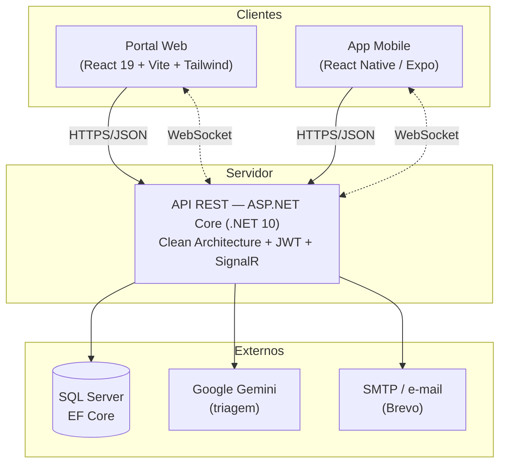
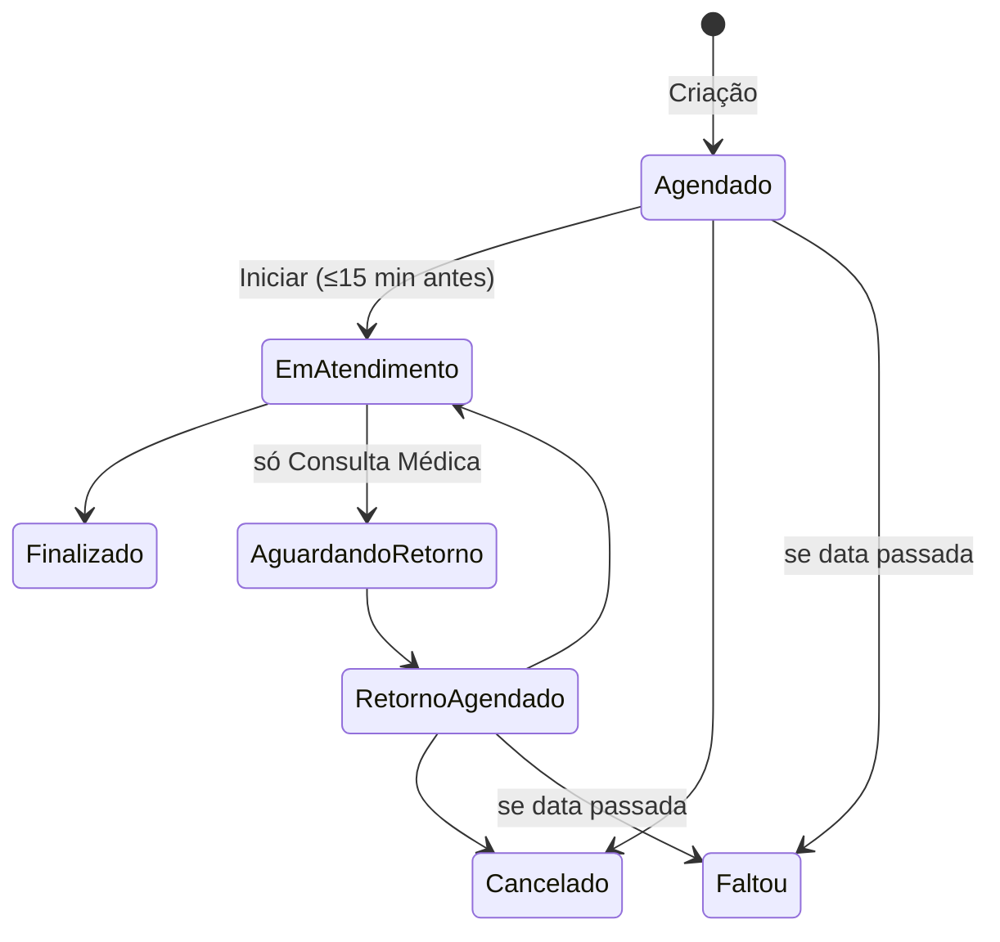

# Arquitetura do Sistema — Clínica Mais Saúde

Seção de arquitetura para a monografia do PIM IV (insumo das rubricas 05 — Web e 06 — Mobile, e da 08 —
qualidade/DevOps). Descreve a solução **como está implementada** hoje.

---

## 1. Visão geral

O **Clínica Mais Saúde** é um sistema de gestão clínica que cobre o ciclo de atendimento ambulatorial:
**triagem por IA → agendamento inteligente → atendimento → resultados de exame → relatórios**, com quatro
perfis de usuário (**Administrador, Médico, Enfermeira, Paciente**). É um **monorepo** com três aplicações
que consomem uma única **API REST**:

- **Portal web** (React) — uso administrativo e clínico (recepção, profissionais, gestão).
- **Aplicativo mobile** (React Native/Expo) — exclusivo do paciente (autoatendimento).
- **API .NET** (Clean Architecture) — regra de negócio e integração com banco, IA e e-mail.

---

## 2. Padrão arquitetural — Clean Architecture

O backend segue **Clean Architecture**: as dependências apontam para dentro
(`API → Application → Domain`; `Infrastructure → Application/Domain`), isolando a regra de negócio de
detalhes de framework e infraestrutura.

| Camada | Responsabilidade | Exemplos |
|--------|------------------|----------|
| **Domain** | Núcleo puro: entidades ricas (setters privados, mutação por métodos de domínio), enums, interfaces de repositório, constantes. Sem dependências externas. | `Agendamento`, `Pessoa`, `Usuario` (`LoginPortal`), `Paciente`, `CodigoVerificacao`, `RoleUsuario` |
| **Application** | Casos de uso, DTOs, validações, interfaces de serviço. Orquestra o domínio. | `AgendamentoService`, `IModeloDeclaracaoService`, DTOs por domínio |
| **Infrastructure** | Detalhes: EF Core (`ClinicaDbContext`, migrations, repositórios), IA (Gemini), e-mail (SMTP), auth (JWT/BCrypt). | `AuthService`, `ConsultaService`, `AutoCadastroService`, `SmtpEmailService` |
| **API** | Camada web: controllers, injeção de dependências, middleware, SignalR, background services. | `AgendamentosController`, `NotificacaoHub`, `Program.cs` |

**Benefícios para o projeto:** testabilidade (regra de negócio testável sem banco), baixo acoplamento
(trocar SGBD ou provedor de IA não toca o Domain) e clareza de responsabilidades.

---

## 3. Stack tecnológica

| Camada | Tecnologia |
|--------|------------|
| Backend | C# / **.NET 10** (ASP.NET Core), Clean Architecture, EF Core 10, FluentValidation |
| Banco | **SQL Server** (LocalDB em dev) via EF Core Migrations |
| Frontend web | **React 19** + TypeScript, **Vite**, **Tailwind CSS**, design system "navy", `lucide-react`, `recharts` |
| Mobile | **React Native / Expo (SDK 54)**, expo-router, expo-secure-store, biometria |
| IA | **Google Gemini** (triagem de sintomas) |
| Tempo real | **SignalR** (WebSocket) para notificações; `HostedService` para geração periódica |
| Autenticação | **JWT** (HMAC-SHA256): acesso 3h / refresh 7 dias; **BCrypt** para senhas |
| E-mail | **SMTP (Brevo)** via `IEmailService` (recuperação de senha, códigos, confirmações) |
| Exportação | **QuestPDF** (PDF), **ClosedXML** (Excel) |
| Acessibilidade | **VLibras** (Libras) no web — ver [`../acessibilidade/`](../acessibilidade/) |

---

## 4. Modelo de identidade e dados

A identidade é normalizada em torno da tabela **`Pessoa`** (Nome/CPF/E-mail/Telefone, únicos), separada da
credencial **`LoginPortal`** (senha, papel, estado de login) e dos perfis magros **`Paciente`** e
**`Profissional`**. O papel do usuário é um enum unificado **`RoleUsuario`** (Paciente/Admin/Médico/
Enfermeira) com tabela de referência. Todos os enums viram *lookups* com FK (integridade referencial real).

O detalhamento completo (26 tabelas, MER, DDL, procedures e triggers) está em
[`../banco/`](../banco/MODELO_DADOS.md).

---

## 5. Domínio central — Agendamento

O agendamento é o coração do sistema, governado por uma **máquina de estados** estrita e por regras de
negócio ricas (matriz de permissões por tipo de profissional, auto-delegação com balanceamento de carga,
limites diários, carência por especialidade, previsão de faltas).

Cada transição gera um registro **imutável** em `AgendamentoHistoricos` (trilha de auditoria — RF09),
reforçado por *trigger* de banco (ver [`../banco/02_procedures_triggers.sql`](../banco/02_procedures_triggers.sql)).
A **previsão de falta** (`ProbabilidadeFaltaService`) é uma heurística explicável baseada no histórico do
paciente. As regras detalhadas estão em `../../requisitos_e_regras.md`.

---

## 6. Triagem inteligente e segurança de IA

O paciente descreve sintomas em linguagem livre e a IA (`ConsultaService`) sugere tipo de atendimento e
especialidade. A integração é **defensiva**:

- **Rate limiting**: 100 req/hora global + 5/dia por usuário.
- **Prompt injection / conteúdo perigoso** → banimento, cancelamento das consultas futuras, registro em
  `UsoInadequadoIA` e notificação aos administradores.
- **Sintomas irrelevantes** → penalidade escalonada (bloqueio temporário da IA).
- Toda a inteligência e as penalidades vivem **exclusivamente** no `ConsultaService` (isolamento de camada).

---

## 7. Segurança

- **JWT** HMAC-SHA256 (acesso 3h / refresh 7 dias) com **rotação** de refresh token.
- **BCrypt** para senhas; **HMAC-SHA256 + pepper** para códigos de e-mail; **SHA-256** para tokens de reset.
- **Anti-brute-force**: 5 tentativas → bloqueio temporário de login.
- **RBAC** por papel (`[Authorize(Roles=…)]`) + *superusuário* admin.
- **Bloqueio em tempo real**: middleware derruba (403) usuário banido a cada requisição, mesmo com token válido.
- **Sanitização** de entrada (máscaras) no backend; **PKs `Guid`** (não expõe IDs sequenciais).
- **Consultas parametrizadas** pelo EF Core (mitiga SQL Injection); **LGPD**: consentimento registrado e
  verificação de e-mail no auto-cadastro.
- **Segredos** via configuração/User Secrets (`JwtConfig:Secret`, `GeminiAI:ApiKey`, pepper, SMTP).

---

## 8. Tempo real e notificações

- **SignalR** (`NotificacaoHub`) entrega notificações em tempo real ao cliente em primeiro plano.
- **`NotificacaoBackgroundService`** (a cada 5 min) gera avisos automáticos: consulta não finalizada 2h
  após o horário, lembrete "consulta hoje" e "2h antes".
- Notificações persistidas (`Notificacoes`) com feed de lidas/não lidas; **push nativo (FCM)** para app
  fechado está no backlog.

---

## 9. Frontend web e app mobile

**Web (SPA React):** navegação por estado (sem React Router), comunicação por *CustomEvents*, resiliência
global a erros de rede (interceptor de `fetch` com *refresh* transparente em 401), **design system navy**
(tokens no Tailwind, componentes primitivos, modais via portal). Acessibilidade: `lang`, *skip link*,
landmarks, **VLibras**.

**Mobile (Expo/React Native):** exclusivo do paciente; login com **biometria/app-lock**, agendamento via
IA ou manual, minhas consultas, notificações com *badge*, perfil (dados/foto/senha), exclusão de conta e
**auto-cadastro em wizard** com verificação de e-mail. Consome a mesma API REST.

---

## 10. Qualidade e DevOps

- **Testes automatizados** (xUnit): domínio + aplicação + infraestrutura (~107 casos), cobrindo regras
  críticas (agendamento, auto-cadastro, recuperação de senha, editor da DS).
- **CI** (GitHub Actions): build .NET + testes + build web + `tsc` do mobile a cada *push*.
- **Homologação E2E** (`homologar-sistema-completo.js`): validações ponta a ponta contra o servidor.
- **Artefatos de deploy** prontos: `Dockerfile` (multi-stage), `docker-compose.yml`, `DEPLOY.md`
  (parametrização por variáveis de ambiente). Publicação em nuvem e pipeline de CD estão no backlog.

---

## 11. Decisões arquiteturais e justificativas (resumo)

| Decisão | Justificativa |
|---------|---------------|
| Clean Architecture | Testabilidade e independência de framework/infra. |
| Entidades ricas (sem *anemic model*) | Invariantes de negócio protegidas no domínio. |
| Identidade normalizada (`Pessoa`) | Fonte única de identidade; suporta proponente sem login (auto-cadastro). |
| Lookups com FK para todo enum | Integridade referencial e legibilidade no banco. |
| API REST única para web + mobile | Reuso total da regra de negócio; consistência entre plataformas. |
| SignalR + background service | Tempo real sem acoplar geração de avisos ao request do usuário. |
| Guid como PK | Não expõe volume/sequência; geração distribuída. |
