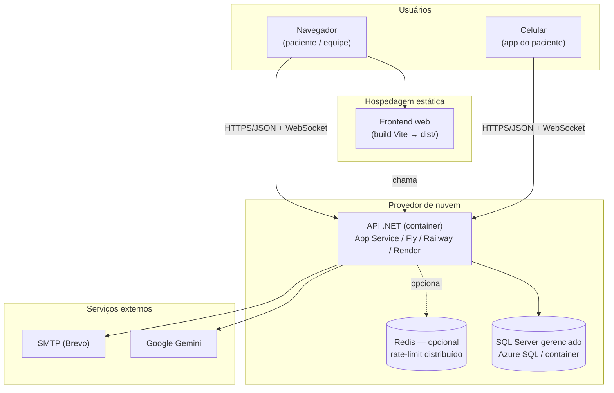
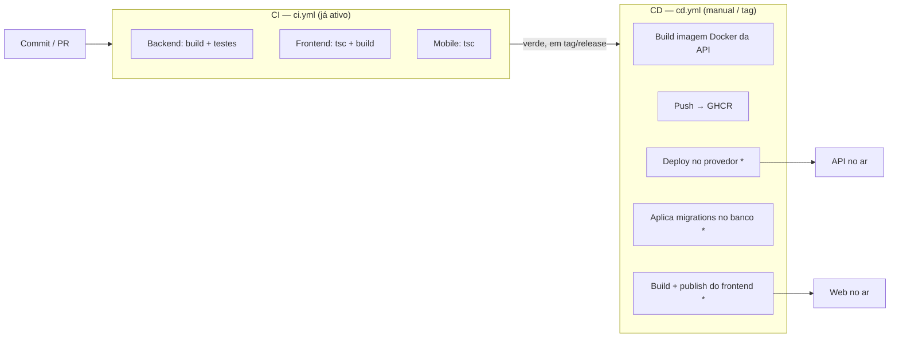

# Arquitetura em Nuvem, CI/CD e DevOps — Clínica Mais Saúde

Artefato do PIM IV (rubrica 08 — Nuvem e DevOps). Descreve como o sistema é publicado em nuvem e como a
esteira de **CI/CD** leva o código do *commit* ao ambiente. O desenho é **agnóstico de provedor**: cada
componente indica os alvos possíveis; a escolha final (§5) é um passo posterior.

---

## 1. Topologia em nuvem

Cada aplicação do monorepo roda num tipo de serviço diferente. A API já lê **toda** a configuração por
variável de ambiente (ver [`../../DEPLOY.md`](../../DEPLOY.md)), então publicar é configuração — não reescrita.

O **app mobile** não é "hospedado": é compilado (APK/IPA) via **EAS Build (Expo)** e distribuído; ele só
precisa apontar `EXPO_PUBLIC_API_URL` para a URL pública da API.

---

## 2. Componentes e responsabilidades

| Componente | Onde roda | Observações |
|-----------|-----------|-------------|
| **API .NET** | Container num PaaS (Azure App Service, Fly.io, Railway, Render) | Imagem já pronta em [`ClinicaMaisSaude.API/Dockerfile`](../../ClinicaMaisSaude.API/Dockerfile) |
| **Banco** | SQL Server gerenciado | O app é **SQL Server-específico** (rowversion, índices filtrados, procedures T-SQL) → exige SQL Server (Azure SQL) ou um container SQL Server, **não** Postgres |
| **Frontend web** | Hospedagem estática/CDN | `npm run build` → `dist/`; sobe em Netlify, Vercel, Cloudflare Pages ou Azure Static Web Apps |
| **Mobile** | EAS Build | Gera o binário; publicação nas lojas é opcional |
| **Redis** | Opcional | A API funciona sem ele (cai no cache em memória); habilita rate-limit multi-instância |
| **Registry de imagem** | GHCR (GitHub Container Registry) | Neutro — funciona com qualquer provedor |
| **Segredos** | Cofre do provedor + GitHub Secrets | JWT, senha do banco, Gemini, SMTP, pepper |

---

## 3. Esteira CI/CD

`*` = passos que dependem do provedor/segredos escolhidos (ver §5). O [`cd.yml`](../../.github/workflows/cd.yml)
já implementa o que é **agnóstico** (build + push da imagem para o GHCR e o *artifact* do frontend) e deixa
os passos de deploy/migração **comentados**, prontos para ativar quando o provedor for definido.

### Integração Contínua (CI) — já em produção
[`.github/workflows/ci.yml`](../../.github/workflows/ci.yml): a cada *push*/PR em `main`/`teste`, roda em
paralelo o build+testes do backend, o build do frontend e o *typecheck* do mobile. É o **portão de
qualidade** que antecede qualquer deploy.

### Entrega Contínua (CD) — pronta para ativar
[`.github/workflows/cd.yml`](../../.github/workflows/cd.yml): dispara **manualmente** (`workflow_dispatch`)
ou ao publicar uma **tag** `v*` (não roda a cada push, para não gastar minutos nem publicar sem intenção).
Faz o build da imagem da API e o *push* para o GHCR; os passos de deploy/migração são ativados por provedor.

---

## 4. Estratégia de migração de banco

A API **não migra o banco no startup** por padrão (decisão de segurança — evita alteração de schema
inesperada em produção). Duas opções para o CD:

1. **Passo no pipeline (recomendado):** um job `dotnet ef database update` conectado ao banco gerenciado
   via *secret* `PROD_DB_CONNECTION`. Explícito, versionado e auditável. (Esboçado, comentado, no `cd.yml`.)
2. **Migração no startup:** ligar a aplicação automática de migrations ao subir a API. Mais simples, porém
   menos controlado. Alternativa aceitável para ambientes pequenos.

O DDL de referência também está em [`../banco/01_schema.sql`](../banco/01_schema.sql).

---

## 5. Escolha de provedor (decisão pendente)

| Opção | API | Banco | Web | Prós | Contras |
|-------|-----|-------|-----|------|---------|
| **Azure** (recomendado p/ .NET) | App Service (container) | **Azure SQL Database** (gerenciado) | Static Web Apps | "Livro-texto" p/ .NET; SQL Server gerenciado nativo; **Azure for Students** dá crédito | Curva/console maior |
| **Fly.io / Railway** | Container | SQL Server em container (volume) | Netlify/Vercel | Simples e barato | Você gerencia o SQL Server (backup/HA) |
| **Render** | Container | (sem SQL Server gerenciado) | Static Site | Deploy fácil por Git | SQL Server exige container próprio |

**Recomendação:** **Azure** se houver conta de estudante (melhor narrativa e SQL Server gerenciado). Caso
contrário, **Fly.io** (API + SQL Server container) + **Netlify** (web) é o caminho de menor custo.

Ao decidir, preencher no `cd.yml` os passos de deploy e cadastrar os *secrets* do provedor.

---

## 6. Segredos e configuração

Todos já parametrizados (ver [`../../.env.example`](../../.env.example) e [`../../DEPLOY.md`](../../DEPLOY.md)):
`JwtConfig__Secret`, `ConnectionStrings__DefaultConnection`, `GeminiAI__ApiKey`, `Security__CodigoRecuperacaoPepper`,
`EmailConfig__*`, `AdminSeed__*`, `Cors__AllowedOrigins__0`. No CD, vivem em **GitHub Secrets**; em runtime,
no cofre do provedor.

---

## 7. O que falta para publicar de fato

- [ ] Escolher o provedor (§5) e criar a conta.
- [ ] Provisionar o banco gerenciado e obter a *connection string*.
- [ ] Cadastrar os *secrets* (GitHub + provedor).
- [ ] Ativar os passos de deploy/migração no [`cd.yml`](../../.github/workflows/cd.yml).
- [ ] Apontar `EXPO_PUBLIC_API_URL` (mobile) e `VITE_API_URL` (web) para a URL pública.

> Estes passos envolvem conta, credenciais e custo — são executados pelo responsável do projeto. O diagrama,
> o pipeline e a documentação (este pacote) fecham a rubrica 08 na monografia independentemente da publicação.
