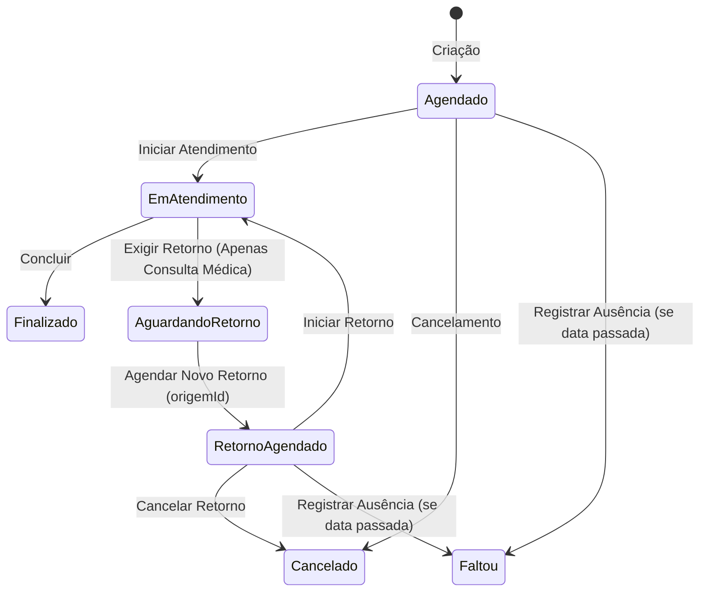

# 🏥 Clínica Mais Saúde — Documento de Requisitos e Regras de Negócio

Este documento apresenta a análise arquitetural, os requisitos e todas as regras de negócio consolidadas do sistema **Clínica Mais Saúde**, servindo como única fonte da verdade técnica e funcional do projeto.

---

## 1. Requisitos Funcionais (RF)

Os Requisitos Funcionais descrevem as ações e funcionalidades que o sistema fornece aos usuários (Pacientes, Profissionais de Saúde e Administradores).

*   **RF01 - Gestão de Autenticação e Autorização:** O sistema deve permitir o login seguro de usuários (Pacientes, Médicos, Enfermeiros e Administradores) utilizando controle de acesso baseado em perfis (RBAC - Role-Based Access Control) via JWT.
*   **RF02 - Gestão de Pacientes:** O sistema deve permitir o cadastro, edição e visualização de dados de pacientes, incluindo nome, CPF, e-mail, telefone e foto de perfil.
*   **RF03 - Gestão de Profissionais:** O sistema deve permitir o cadastro de profissionais de saúde, especificando seu tipo (Médico, Enfermeira), CRM e especialidades médicas vinculadas.
*   **RF04 - Agendamento de Consultas:** O sistema deve permitir a criação, reagendamento, cancelamento e alteração de status de consultas.
*   **RF05 - Triagem Inteligente com IA:** O sistema deve possuir integração com inteligência artificial para sugerir especialidades médicas adequadas a partir dos sintomas livres relatados pelo paciente, contando com bloqueios de abuso e injeção de prompt.
*   **RF06 - Gestão de Status de Agendamentos:** O sistema deve evoluir e validar o status do agendamento de acordo com uma máquina de estados estrita.
*   **RF07 - Dashboard Analítico de Gestão:** O sistema deve apresentar um painel em tempo real contendo métricas operacionais para Administradores (taxa de absenteísmo, volume de consultas, distribuição por especialidades).
*   **RF08 - Exportação de Relatórios:** O sistema deve permitir a exportação de relatórios gerenciais nos formatos PDF (QuestPDF) e Excel (ClosedXML).
*   **RF09 - Trilha de Auditoria (Audit Trail):** O sistema deve registrar de forma inalterável todas as criações, remarcações, cancelamentos e alterações de status de consultas na tabela de histórico (`AgendamentoHistoricos`), identificando o usuário responsável.
*   **RF10 - Sistema de Notificações de Exames:** O sistema deve rastrear consultas que necessitam de laudos de exames e notificar o paciente assim que os resultados estiverem disponíveis, com links para visualização direta.

---

## 2. Requisitos Não Funcionais (RNF)

Os Requisitos Não Funcionais definem as premissas técnicas, restrições arquiteturais, performance e segurança.

### 2.1 Arquitetura e Stack Tecnológica
*   **RNF01 - Backend (API):** Desenvolvido em **.NET 10 (ASP.NET Core)** utilizando o padrão **Clean Architecture** (Domain, Application, Infrastructure, API).
*   **RNF02 - Frontend (SPA):** Desenvolvido em **React 19 com TypeScript**, utilizando **Vite** e **Tailwind CSS v3**.
*   **RNF03 - Persistência:** Banco de dados relacional **SQL Server** mapeado via **Entity Framework Core**.

### 2.2 Segurança
*   **RNF04 - Autenticação JWT:** Tokens de acesso criptografados e assinados digitalmente com HMAC-SHA256. Janela de expiração estrita de **3 horas** para sessões ativas e **7 dias** para tokens de renovação (Refresh Tokens).
*   **RNF05 - Chaves Primárias:** Uso exclusivo do tipo estruturado **`Guid` (UUID)** gerado via aplicação para chaves primárias. É proibido expor IDs numéricos sequenciais.
*   **RNF06 - Criptografia de Senhas:** Senhas devem ser salvas de forma segura usando o algoritmo hash **BCrypt**.

### 2.3 Performance
*   **RNF07 - Paginação Server-Side:** Consultas de listagem longa devem ser paginadas diretamente no banco de dados usando os métodos de skip/take do Entity Framework Core.
*   **RNF08 - Otimização de Leitura:** Todas as requisições GET (leitura pura) no Entity Framework devem utilizar obrigatoriamente o método **`.AsNoTracking()`** para economizar memória e processamento.

### 2.4 Interface e Usabilidade
*   **RNF09 - Responsividade e UX:** Interface responsiva seguindo estilo estético roxo premium ("Bold & Purple"), sombras profundas e ícones "Lucide React".
*   **RNF10 - Resiliência Visual:** Frontend deve tratar de maneira global as requisições assíncronas, fornecendo avisos limpos e impedindo travamento de tela (*White Screen of Death*).

---

## 3. Regras de Negócio Gerais (RN)

*   **RN01 - Sanitização de Dados:** A higienização de inputs e remoção de máscaras (CPF, Telefones) deve ser feita estritamente no Backend (camada Application/Services). O Frontend envia os dados brutos.
*   **RN02 - Segurança de Acesso (Bloqueio por Força Bruta):** Se um usuário realizar 5 tentativas incorretas de senha seguidas, a conta deve ser bloqueada temporariamente por 15 minutos (`BloqueadoAte = UTC+5min`).
*   **RN03 - IA - Rate Limiting & Proteção contra Abuso:** 
    *   **Limites de Uso:** O processamento de sintomas por IA é limitado a 100 chamadas globais por hora no sistema e a 5 chamadas diárias por usuário.
    *   **Prompt Injection:** Mensagens ofensivas, tentativas de burlar as regras de segurança ou inputs fora do escopo de saúde causam o banimento imediato e permanente do usuário (bloqueio de login por +100 anos), cancelamento automático de todas as suas consultas futuras ativas e disparo de notificação administrativa.

---

## 4. Regras de Negócio do Módulo de Agendamentos (RN-AG)

### 4.1 Matriz de Permissões Clínicas
O tipo do profissional de saúde restringe estritamente o tipo de consulta que ele está habilitado a executar:

| Tipo de Consulta | Enfermeira(o) | Médico(a) |
|---|---|---|
| Triagem | ✅ | ❌ |
| Exame | ✅ | ❌ |
| Vacina | ✅ | ❌ |
| Consulta Médica | ❌ | ✅ |
| Retorno | ❌ | ✅ |

### 4.2 Especialidades Médicas Válidas
As especialidades médicas suportadas pelo sistema e cadastradas no backend (`EspecialidadeMedica.cs`) são:
*   Clínica Geral (0)
*   Medicina de Família (1)
*   Pediatria (2)
*   Ginecologia e Obstetrícia (3)
*   Cardiologia (4)
*   Dermatologia (5)
*   Endocrinologia (6)
*   Gastroenterologia (7)
*   Neurologia (8)
*   Ortopedia e Traumatologia (9)
*   Psiquiatria (10)
*   Otorrinolaringologia (11)
*   Oftalmologia (12)
*   Urologia (13)
*   Pneumologia (14)
*   Reumatologia (15)
*   Geriatria (16)
*   Medicina Esportiva (18)

### 4.3 Duração das Consultas e Slots de Agendamento
Cada tipo de consulta tem uma duração padronizada em minutos:
*   **Vacina:** 15 minutos
*   **Triagem:** 20 minutos
*   **Retorno:** 20 minutos
*   **Exame:** 30 minutos
*   **Consulta Médica:** 40 minutos

### 4.4 Validação de Conflito de Horário Inteligente
É proibido realizar agendamentos que gerem sobreposição de horários para um mesmo Profissional ou para um mesmo Paciente. A sobreposição é calculada em tempo real com base no início e término previsto da consulta (utilizando a duração do slot):
```
(Novo_Inicio >= Existente_Inicio E Novo_Inicio < Existente_Fim) OU
(Novo_Fim > Existente_Inicio E Novo_Fim <= Existente_Fim) OU
(Novo_Inicio <= Existente_Inicio E Novo_Fim >= Existente_Fim)
```

### 4.5 Auto-delegação e Balanceamento de Carga
*   **Atribuição Automática:** Pacientes e recepcionistas não selecionam o profissional de saúde diretamente na criação do agendamento (exceto no fluxo de Retorno). O backend delega o profissional automaticamente.
*   **Lógica de Delegação:** O sistema filtra os profissionais do tipo correto (Matriz de Permissões) e habilitados na especialidade selecionada (se for médico). Dentre os candidatos livres e sem conflito de horário no slot, o agendamento é atribuído àquele com o **menor volume de consultas ativas** registradas, balanceando a carga de trabalho.

### 4.6 Regras Estritas de Agendamento
*   **Não Retroatividade:** É proibido efetuar agendamentos para datas e horários passados.
*   **Agendamento por Terceiros:** Pacientes no portal de autoatendimento só podem efetuar agendamentos vinculados ao seu próprio `PacienteId` obtido através das claims JWT.
*   **Limite Diário de Consultas Ativas (Limite A):** Um paciente pode possuir no máximo 2 agendamentos ativos (não finalizados/cancelados) agendados para a mesma data.
*   **Limite Diário de Criações (Limite B):** Um paciente pode criar no máximo 3 agendamentos no mesmo dia civil (evitando criação maliciosa em massa).
*   **Especialidade Ativa Única:** Um paciente só pode ter no máximo **um** agendamento ativo por especialidade médica simultaneamente.
*   **Carência de 60 Dias:** Se um paciente tiver realizado e finalizado uma consulta de uma determinada especialidade médica nos últimos 60 dias, ele fica proibido de marcar um novo agendamento autônomo pelo portal para esta especialidade (novos agendamentos neste intervalo devem ser marcados presencialmente/pela recepção).
*   **Vínculo do Profissional em Retornos:**
    *   Um agendamento do tipo "Retorno" só pode ser criado se houver uma consulta inicial anterior concluída com status de `AguardandoRetorno`.
    *   O agendamento de retorno é travado obrigatoriamente ao mesmo profissional que atendeu a consulta inicial de origem, herdando o `ProfissionalId` e ignorando a regra de balanceamento de carga.

### 4.7 Máquina de Estados e Transições de Status
O ciclo de vida do agendamento obedece rigidamente à seguinte máquina de estados, e qualquer transição fora do fluxo descrito é rejeitada:



#### Regras das Transições:
*   **Iniciar Atendimento (➔ EmAtendimento):** Só é permitido iniciar a consulta a partir de no máximo **15 minutos de antecedência** do horário agendado.
*   **Exigir Retorno (➔ AguardandoRetorno):** Apenas permitido se o tipo da consulta for `Consulta Médica` e o status atual for `EmAtendimento`.
*   **Agendar Novo Retorno (➔ RetornoAgendado):** Ativado na consulta de origem automaticamente quando a recepção/paciente agenda o retorno vinculado.
*   **Registrar Ausência (➔ Faltou):** Só é permitido transicionar um agendamento (`Agendado` ou `RetornoAgendado`) para `Faltou` se a data e hora prevista da consulta já tiverem passado (bloqueado para datas futuras).
*   **Cancelamento (➔ Cancelado):** Pode ser efetuado por pacientes ou recepcionistas.
